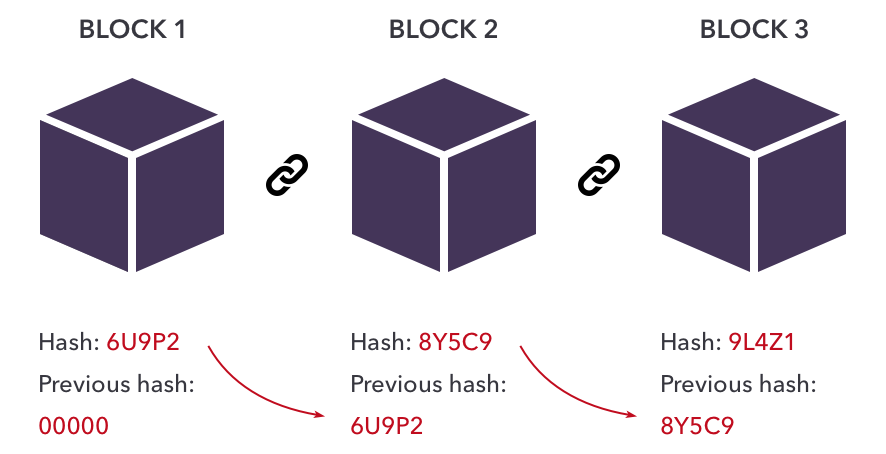

# Các Khái Niệm Cơ Bản Trong Blockchain

## 1. Blockchain là gì?
Về cốt lõi, blockchain là một sổ cái kỹ thuật số phân tán lưu trữ dữ liệu dưới bất kỳ hình thức nào. Một blockchain có thể ghi lại thông tin về các giao dịch tiền điện tử, NFT quyền sở hữu hoặc Defi hợp đồng thông minh.

Mặc dù bất kỳ cơ sở dữ liệu thông thường nào cũng có thể lưu trữ loại thông tin này nhưng Blockchain là duy nhất ở chỗ nó hoàn toàn phi tập trung. Thay vì được duy trì ở một server tập trung, nhiều bản sao giống hệt nhau của cơ sở dữ liệu Blockchain được lưu giữ trên nhiều máy tính trải rộng trên toàn bộ mạng. Các máy tính riêng lẻ này được gọi là các nút mạng (node).

- **Blockchain đối với người dùng cuối** là 1 sổ cái phi tập trung, và ai cũng có thể lưu trữ bản sao giống hệt nhau.

- **Với dân kĩ thuật** thì Blockchain như một cơ sở dữ liệu được phân tán trên nhiều node (máy tính riêng biệt) và mỗi node thì chứa data hoàn toàn giống nhau.

- **Sổ cái Ledger** là định nghĩa trong tài chính, nó dùng để lưu trữ tất cả các giao dịch (transaction).

- **Bitcoin** là một sản phẩm hiện thực hóa ứng dụng công nghệ Blockchain. Sau này có rất nhiều các mạng Blockchain khác ra đời như là Ethereum, Solana, Fantom...

Hình ở dưới đây mô tả cách hoạt động cơ bản của một Blockchain:  

  

Cái tên blockchain không phải ngẫu nhiên được chọn để sử dụng như bây giờ. Blockchain thường được mô tả là một “chuỗi” được tạo thành từ các “khối” dữ liệu riêng lẻ. Khi dữ liệu mới được thêm vào mạng định kỳ, một “khối” mới sẽ được tạo và gắn vào “chuỗi”. Điều này liên quan đến việc tất cả các nút cập nhật phiên bản blockchain của họ để tất cả đều giống hệt nhau.
  
Hình ở dưới đây mô tả cách 1 block mới được thêm vào chuỗi:  

  
Các khối được nối vào nhau liên tiếp và mỗi khối ở sau mang thông tin mã hóa từ khối trước nó. Điều này làm cho Blockchain gần như không thể bị tác động hoặc thay đổi, giả mạp dữ liệu.

Mỗi block sẽ chưa một hoặc nhiều các thông tin dữ liệu. Thông thường là những giao dịch về chuyển tiền, giao tiếp với hợp đồng thông minh...
Trên Blockchain sẽ không chứa các thông tin về ví. Nó chỉ chứa các giao dịch ứng với ví đó mà thôi.
## 2. Cơ bản về Proof of Work (PoW)

## 3. Wallet trong Blockchain

## 4. Mnemonic là gì?

## 5. Ethereum và Smart Contract

## 6. Phân biệt Coin và Token

## 7. Decentralized Application (dApp) và Web3

## 8. Các vấn đề của dApp

## 9. NFT là gì?

## 10. NFT có thay thế cho mọi sản phẩm không?
